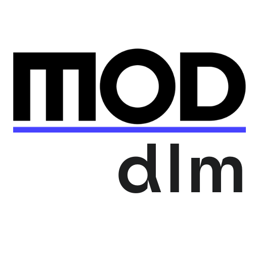

# mod-dlm

**mod-dlm** is an open source project designed to create a domain-specific language (DSL) for describing prefab elements in the Architecture, Engineering, and Construction (AEC) industry. This project provides tools for defining entity models and automatically generating CRUD APIs, enabling suppliers to create and manage catalogs of their products easily.

## Table of Contents
- [Features](#features)
- [Getting Started](#getting-started)
- [Installation](#tinstallation)
- [Usage](#usage)
- [Contributing](#contributing)
- [License](#license)

## Features
- **Domain-Specific Language**: Define prefab elements with a custom DSL tailored for the AEC industry.
- **Automatic CRUD API Generation**: Generate RESTful APIs for managing prefab elements.
- **Multi-language Support**: Define entities once and generate code in multiple languages including TypeScript, Python, Java, and Go.
- **3D Visualization**: Support for visualizing 3D bounding boxes of prefab elements.
- **Comprehensive Metadata**: Include critical attributes such as material composition, dimensions, weight, thermal properties, and more.
- **Extensible**: Easily extend the language and API generation capabilities to fit specific needs.

## Getting Started

### Prerequisites
- Node.js

### Installation
1. **Clone the Repository**:
   ```bash
   git clone git@github.com:mod-construction/mod-dlm.git
   cd mod-dlm
   ```
2. Run `npm install` in the repo root.

### Usage

#### `npm start`
Starts the reference docs preview server.

#### `npm run build`
Bundles the definition to the dist folder.

#### `npm test`
Validates the definition.

## Contribute

Interested in contributing to this project? Here are some ways you can support us:

- Submit a pull request.
- Star us on Github.
- Tell a friend or colleague about us (or Tweet about us).
- Write an article or blog post. Let us know by opening an issue with a link to the article.
- Looking to build a modern documentation workflow? Our [commercial products](https://redoc.ly) can help you maintain and deploy API reference docs and developer portals.

