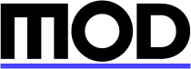
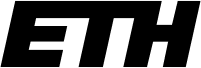

<div align="center">
  <a href="https://mod.construction/docs/" target="blank">

  </a>

Open source domain specific language to describe prefab construction elements.


[](https://www.npmjs.com/package/tsoa)

</div>

# mod-dlm

**mod-dlm** is an open source project designed to create a domain-specific language (DSL) for describing prefab elements in the Architecture, Engineering, and Construction (AEC) industry. This project provides tools for defining entity models and automatically generating CRUD APIs, enabling suppliers to create and manage catalogs of their products easily.

## Supporting partners
<div align="center">
    <a href="https://mod.construction/" target="blank">
        
    </a>
    <a href="https://cee.stanford.edu/" target="blank">
        
    </a>
    <a href="https://dfab.ch/" target="blank">
        
    </a>
    <a href="https://arch.ethz.ch/" target="blank">
        
    </a>
    <a href="https://www.zhaw.ch/" target="blank">
        
    </a>
    <a href="https://opensource.construction/" target="blank">
        
    </a>
</div>

## Table of Contents
- [Features](#features)
- [Getting Started](#getting-started)
- [Installation](#tinstallation)
- [Usage](#usage)
- [Contributing](#contributing)
- [License](#license)

## Features
- **Domain-Specific Language**: Define prefab elements with a custom DSL tailored for the AEC industry.
- **Automatic CRUD API Generation**: Generate RESTful APIs for managing prefab elements.
- **Multi-language Support**: Define entities once and generate code in multiple languages including TypeScript, Python, Java, and Go.
- **3D Visualization**: Support for visualizing 3D bounding boxes of prefab elements.
- **Comprehensive Metadata**: Include critical attributes such as material composition, dimensions, weight, thermal properties, and more.
- **Extensible**: Easily extend the language and API generation capabilities to fit specific needs.

## Getting Started

### Prerequisites
- Node.js

### Installation
1. **Clone the Repository**:
   ```bash
   git clone git@github.com:mod-construction/mod-dlm.git
   cd mod-dlm
   ```
2. Run `npm install` in the repo root.

### Usage

#### `npm start`
Starts the reference docs preview server.

#### `npm run build`
Bundles the definition to the dist folder.

#### `npm test`
Validates the definition.

## Help wanted

### Contributing code

To contribute create an issue and open a pull-request.
