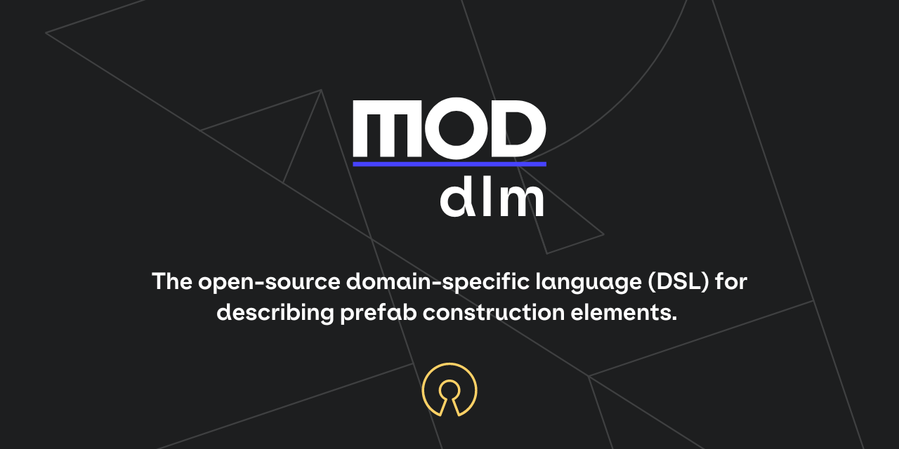

<div align="center">
  <a href="https://mod.construction/" target="_blank">

  </a>

Open source domain specific language to describe prefab construction elements.

<br/>

[](https://github.com/mod-construction/mod-dlm/actions/workflows/apidoc.yml)
[](https://github.com/mod-construction/mod-dlm/actions/workflows/publish.yml)
[](https://www.npmjs.com/package/@mod-construction/mod-dlm)
[](https://pypi.org/project/mod-dlm-server/)
[](https://opensource.org/licenses/MIT)


<br/>
  <a href="https://mod-construction.github.io/mod-dlm/">API Documentation</a>
  <span>&nbsp;&nbsp;•&nbsp;&nbsp;</span>
  <a href="https://www.npmjs.com/package/@mod-construction/mod-dlm">npm</a>
  <span>&nbsp;&nbsp;•&nbsp;&nbsp;</span>
  <a href="https://pypi.org/project/mod-dlm-server/">FastAPI Server</a>
  <span>&nbsp;&nbsp;•&nbsp;&nbsp;</span>
  <a href="https://github.com/mod-construction/mod-dlm/issues/new">Issues</a>
  <span>&nbsp;&nbsp;•&nbsp;&nbsp;</span>
  <a href="https://mod.construction">mod.construction</a>
  <br />

</div>


# mod-dlm

**mod-dlm** is an open-source domain-specific language (DSL) for describing prefab elements in the Architecture, Engineering, and Construction (AEC) industry. This project provides tools for defining entity models and automatically generating CRUD APIs, enabling suppliers to create and manage catalogs of their products easily.

You can always find the most up-to-date API documentation here: https://mod-construction.github.io/mod-dlm/

## Table of Contents
- [Data Model](#data-model)
- [Getting Started](#getting-started)
- [Installation](#tinstallation)
- [Usage](#usage)
- [Hello Prefab Project](#hello-prefab-project)
- [Features](#features)
- [Contributing](#contributing)

## Features
- **Domain-Specific Language**: Define prefab elements with a custom DSL tailored for the AEC industry.
- **Automatic CRUD API Generation**: Generate RESTful APIs for managing prefab elements.
- **Multi-language Support**: Define entities once and generate code in multiple languages including TypeScript, Python, Java, and Go.
- **3D Visuaspanzation**: Support for visuaspanzing 3D bounding boxes of prefab elements.
- **Comprehensive Metadata**: Include critical attributes such as material composition, dimensions, weight, thermal properties, and more.
- **Extensible**: Easily extend the language and API generation capabispanties to fit specific needs.

## Data Model


## Getting Started

For a complete starter guide, see [Hello Prefab Project](#hello-prefab-project)
### Prerequisites
Make sure you have the following installed:
- [Node.js](https://nodejs.org/) (version 16 or later)
- npm (comes with Node.js)

### Installation

```bash
npm install @mod-construction/mod-dlm@latest -D
```

### Usage
You can use **mod-dlm** in different scenarios. 

### 1. Defining a New Element :
```typescript
import { PrefabElement, PrefabElementSchema } from "@mod-construction/mod-dlm";

const examplePrefabElement: PrefabElement = {
    id: '8be9e7b3-de6c-4621-8751-3a1b12d71f94',
    name: 'Insulated Concrete Wall Panel',
    description: 'A high-performance insulated concrete wall panel suitable for residential and commercial buildings.',
    boundingBox: {
        width: 3000, // in millimeters
        height: 6000, // in millimeters
        depth: 200 // in millimeters
    },
    images: [
        'https://example.com/images/panel-front.jpg',
        'https://example.com/images/panel-back.jpg'
    ],
    buildingSystem: 'Wall',
    productCategory: 'Insulated Concrete Panels',
    material: {
        finishMaterial: 'Concrete',
        structuralMaterial: 'Concrete'
    },
    dimensional: {
        width: {
            min: 1000,
            max: 4000
        },
        height: {
            min: 2000,
            max: 8000
        },
        length: {
            min: 100,
            max: 300
        }
    },
    structuralProperties: {
        loadBearingCapacity: {
            maximumLoad: 5000,
            unit: 'kN',
            loadDistribution: 'Uniform'
        },
        seismicResistance: 'Zone 3',
        windLoadResistance: 'Class C'
    },
    performance: {
        resistanceToFireClassification: 'A2',
        thermalTransmittance: 0.25,
        acousticProperties: {
            soundInsulationRating: 'Rw 55 dB',
            acousticPerformance: 'High'
        }
    },
    sustainability: {
        countryOfManufacturing: 'Germany',
        classification: 'A',
        VOCEmissions: 'Low',
        recyclability: '75%',
        energyEfficiency: 'LEED Gold'
    },
    documentationAndCompliance: {
        technicalSpecifications: 'https://example.com/specifications/panel-001.pdf',
        certifications: {
            certificationTypes: ['ISO 9001', 'CE Marking'],
            regulatoryApprovals: ['EN 14992', 'DIN 4102']
        }
    },
    installationAndConnectivity: {
        connectionType: 'Bolt-on',
        installationTime: '2 hours per panel',
        compatibility: 'Concrete Structure'
    },
    lifecycleAndMaintenance: {
        expectedLifespan: '50 years',
        maintenanceRequirements: 'Periodic inspection every 5 years',
        warranty: '10-year manufacturer warranty'
    },
    aestheticAndCustomizationOptions: {
        colorOptions: ['Gray', 'White', 'Beige'],
        texture: 'Smooth',
        modularAdaptability: 'Compatible with modular building systems'
    },
    economicFactors: {
        costPerUnit: 1500, // in euros
        manufacturingLeadTime: '4 weeks'
    }
};


// You can use this object to interact with other parts of your application or library
console.log('New element defined:', examplePrefabElement);
```

### 2. Validating an Element Using Zod and PrefabElementSchema:
```typescript
import { PrefabElement, PrefabElementSchema } from "@mod-construction/mod-dlm";

const examplePrefabElement: PrefabElement = {
    id: '8be9e7b3-de6c-4621-8751-3a1b12d71f94',
    name: 'Insulated Concrete Wall Panel',
    description: 'A high-performance insulated concrete wall panel suitable for residential and commercial buildings.',
    boundingBox: {
        width: 3000, // in millimeters
        height: 6000, // in millimeters
        depth: 200 // in millimeters
    },
    images: [
        'https://example.com/images/panel-front.jpg',
        'https://example.com/images/panel-back.jpg'
    ],
    buildingSystem: 'Wall',
    productCategory: 'Insulated Concrete Panels',
    material: {
        finishMaterial: 'Concrete',
        structuralMaterial: 'Concrete'
    },
    dimensional: {
        width: {
            min: 1000,
            max: 4000
        },
        height: {
            min: 2000,
            max: 8000
        },
        length: {
            min: 100,
            max: 300
        }
    },
    structuralProperties: {
        loadBearingCapacity: {
            maximumLoad: 5000,
            unit: 'kN',
            loadDistribution: 'Uniform'
        },
        seismicResistance: 'Zone 3',
        windLoadResistance: 'Class C'
    },
    performance: {
        resistanceToFireClassification: 'A2',
        thermalTransmittance: 0.25,
        acousticProperties: {
            soundInsulationRating: 'Rw 55 dB',
            acousticPerformance: 'High'
        }
    },
    sustainability: {
        countryOfManufacturing: 'Germany',
        classification: 'A',
        VOCEmissions: 'Low',
        recyclability: '75%',
        energyEfficiency: 'LEED Gold'
    },
    documentationAndCompliance: {
        technicalSpecifications: 'https://example.com/specifications/panel-001.pdf',
        certifications: {
            certificationTypes: ['ISO 9001', 'CE Marking'],
            regulatoryApprovals: ['EN 14992', 'DIN 4102']
        }
    },
    installationAndConnectivity: {
        connectionType: 'Bolt-on',
        installationTime: '2 hours per panel',
        compatibility: 'Concrete Structure'
    },
    lifecycleAndMaintenance: {
        expectedLifespan: '50 years',
        maintenanceRequirements: 'Periodic inspection every 5 years',
        warranty: '10-year manufacturer warranty'
    },
    aestheticAndCustomizationOptions: {
        colorOptions: ['Gray', 'White', 'Beige'],
        texture: 'Smooth',
        modularAdaptability: 'Compatible with modular building systems'
    },
    economicFactors: {
        costPerUnit: 1500, // in euros
        manufacturingLeadTime: '4 weeks'
    }
};

// Validate the element using the PrefabElementSchema
const validation = PrefabElementSchema.safeParse(examplePrefabElement);

if (validation.success) {
   console.log('Element is valid:', validation.data);
} else {
   console.error('Element validation failed:', validation.error);
}
```
## Hello Prefab Project
This is a short guide to get you up and running in no time, even if you are not familiar with setting up a typescript project.

## Prerequisites

Make sure you have the following installed:
- [Node.js](https://nodejs.org/) (version 16 or later)
- npm (comes with Node.js)

---

## Steps

### 1. Initialize a New Project

1. Open your terminal and create a new directory for your project:
   ```bash
   mkdir mod-dlm-project
   cd mod-dlm-project
   ```
2.	Initialize a new Node.js project:

    ```bash
      npm init -y
    ```

### 2. Install Dependencies

1. Install TypeScript and the required types.
    ```bash
    npm install typescript @types/node --save-dev
    ```
2. Initialize a `TypeScript` configuration file.
    ```bash
    npx tsc --init
    ```
3. To auto-restart your project when you make changes, install `nodemon`.
    ```bash
   npm install nodemon --save-dev
    ```
4. Install `mod-dlm`.
    ```bash
   npm install @mod-construction/mod-dlm@latest -D
    ```

### 3. Configure your project
Update the scripts section in your package.json:

```json
"scripts": {
    "start": "tsc && node index.js",
    "dev": "nodemon --watch src --ext ts --exec \"ts-node index.ts\""
  },
```

### 4. Start coding

1. Create an `index.ts` file in the root and paste the following code in it:
    
```typescript
import { PrefabElement, PrefabElementSchema } from "@mod-construction/mod-dlm";

const examplePrefabElement: PrefabElement = {
    id: '8be9e7b3-de6c-4621-8751-3a1b12d71f94',
    name: 'Insulated Concrete Wall Panel',
    description: 'A high-performance insulated concrete wall panel suitable for residential and commercial buildings.',
    boundingBox: {
        width: 3000, // in millimeters
        height: 6000, // in millimeters
        depth: 200 // in millimeters
    },
    images: [
        'https://example.com/images/panel-front.jpg',
        'https://example.com/images/panel-back.jpg'
    ],
    buildingSystem: 'Wall',
    productCategory: 'Insulated Concrete Panels',
    material: {
        finishMaterial: 'Concrete',
        structuralMaterial: 'Concrete'
    },
    dimensional: {
        width: {
            min: 1000,
            max: 4000
        },
        height: {
            min: 2000,
            max: 8000
        },
        length: {
            min: 100,
            max: 300
        }
    },
    structuralProperties: {
        loadBearingCapacity: {
            maximumLoad: 5000,
            unit: 'kN',
            loadDistribution: 'Uniform'
        },
        seismicResistance: 'Zone 3',
        windLoadResistance: 'Class C'
    },
    performance: {
        resistanceToFireClassification: 'A2',
        thermalTransmittance: 0.25,
        acousticProperties: {
            soundInsulationRating: 'Rw 55 dB',
            acousticPerformance: 'High'
        }
    },
    sustainability: {
        countryOfManufacturing: 'Germany',
        classification: 'A',
        VOCEmissions: 'Low',
        recyclability: '75%',
        energyEfficiency: 'LEED Gold'
    },
    documentationAndCompliance: {
        technicalSpecifications: 'https://example.com/specifications/panel-001.pdf',
        certifications: {
            certificationTypes: ['ISO 9001', 'CE Marking'],
            regulatoryApprovals: ['EN 14992', 'DIN 4102']
        }
    },
    installationAndConnectivity: {
        connectionType: 'Bolt-on',
        installationTime: '2 hours per panel',
        compatibility: 'Concrete Structure'
    },
    lifecycleAndMaintenance: {
        expectedLifespan: '50 years',
        maintenanceRequirements: 'Periodic inspection every 5 years',
        warranty: '10-year manufacturer warranty'
    },
    aestheticAndCustomizationOptions: {
        colorOptions: ['Gray', 'White', 'Beige'],
        texture: 'Smooth',
        modularAdaptability: 'Compatible with modular building systems'
    },
    economicFactors: {
        costPerUnit: 1500, // in euros
        manufacturingLeadTime: '4 weeks'
    }
};


// You can use this object to interact with other parts of your application or library
console.log('New element defined:', examplePrefabElement);

```

### 5. Run your code
To tun your code, simply run the following command in your terminal:

```bash
npm run dev
```


## Contributing

We appreciate feedback and contribution to this project! Before you get started, please see the following:

* [Contribution guidelines](CONTRIBUTING.md)
* [Code of conduct](CODE_OF_CONDUCT.md)

## License

[MIT](LICENSE)
