# mod-dlm

<!-- markdownlint-disable MD033 -->
<div align="center">
  <a href="https://mod.construction/" target="_blank">

  </a>

Open source domain specific language to describe prefab construction elements.

<br/>

[](https://github.com/mod-construction/mod-dlm/actions/workflows/apidoc.yml)
[](https://github.com/mod-construction/mod-dlm/actions/workflows/publish.yml)
[](https://www.npmjs.com/package/@mod-construction/mod-dlm)
[](https://pypi.org/project/mod-dlm-server/)
[](https://opensource.org/licenses/MIT)


<br/>
  <a href="https://mod-construction.github.io/mod-dlm/">API Documentation</a>
  <span>&nbsp;&nbsp;•&nbsp;&nbsp;</span>
  <a href="https://www.npmjs.com/package/@mod-construction/mod-dlm">npm</a>
  <span>&nbsp;&nbsp;•&nbsp;&nbsp;</span>
  <a href="https://pypi.org/project/mod-dlm-server/">FastAPI Server</a>
  <span>&nbsp;&nbsp;•&nbsp;&nbsp;</span>
  <a href="https://github.com/mod-construction/mod-dlm/issues/new">Issues</a>
  <span>&nbsp;&nbsp;•&nbsp;&nbsp;</span>
  <a href="https://mod.construction">mod.construction</a>
  <br />

</div>


**mod-dlm** is an open-source domain-specific language (DSL) for describing prefab elements in the Architecture, Engineering, and Construction (AEC) industry. This project provides tools for defining entity models and automatically generating CRUD APIs, enabling suppliers to create and manage catalogs of their products easily.

You can always find the most up-to-date API documentation here: https://mod-construction.github.io/mod-dlm/

## Table of Contents

- [Data Model](#data-model)
- [Getting Started](#getting-started)
- [Installation](#tinstallation)
- [Usage](#usage)
- [Hello Prefab Project](#hello-prefab-project)
- [Features](#features)
- [Contributing](#contributing)

## Features

- **Domain-Specific Language**: Define prefab elements with a custom DSL tailored for the AEC industry.
- **Automatic CRUD API Generation**: Generate RESTful APIs for managing prefab elements.
- **Multi-language Support**: Define entities once and generate code in multiple languages including TypeScript, Python, Java, and Go.
- **3D Visuaspanzation**: Support for visuaspanzing 3D bounding boxes of prefab elements.
- **Comprehensive Metadata**: Include critical attributes such as material composition, dimensions, weight, thermal properties, and more.
- **Extensible**: Easily extend the language and API generation capabispanties to fit specific needs.

## Data Model

```mermaid
erDiagram
    PrefabElement {
        UUID id
        string name
        string description
        string[] images
        string ifcType
        string bimModelUrl
    }

    PrefabElement ||--|| VersionMetadata : has
    VersionMetadata {
        string version
        string status
        date lastUpdated
    }

    PrefabElement ||--|| BoundingBox : has
    BoundingBox {
        float width
        float height
        float depth
    }

    PrefabElement ||--|| ProductCategory : has
    ProductCategory {
        string category
        string buildingSystem
    }

    PrefabElement ||--|| Material : has
    Material {
        string finishMaterial
        string structuralMaterial
    }

    PrefabElement ||--|| Dimensional : has
    Dimensional {
        Range width
        Range height
        Range length
    }

    Dimensional ||--|| Range : uses
    Range {
        float min
        float max
    }

    PrefabElement ||--|| StructuralProperties : has
    StructuralProperties {
        float safetyFactor
    }

    StructuralProperties ||--|| LoadBearingCapacity : has
    LoadBearingCapacity {
        float maximumLoad
        string forceUnit
        string loadDistribution
        string testStandard
    }

    PrefabElement ||--|| Performance : has
    Performance {
        float thermalTransmittance
        float airTightness
        float vaporPermeability
    }

    Performance ||--|| FireResistance : has
    FireResistance {
        string reactionToFireClassification
        string fireResistanceDuration
    }

    Performance ||--|| AcousticProperties : has
    AcousticProperties {
        float weightedSoundReductionIndex
        float spectrumAdaptationTerm
    }

    PrefabElement ||--|| Sustainability : has
    Sustainability {
    }

    Sustainability ||--|| EnvironmentalImpact : has
    EnvironmentalImpact {
        string classification
        string VOCEmissions
        float recyclability
        string energyEfficiency
    }

    Sustainability ||--|| Circularity : has
    Circularity {
        string disassemblyRating
        string reusePotential
        string refurbishmentScope
        string circularityCertification
    }

    Sustainability ||--|| Origin : has
    Origin {
        string countryOfManufacturing
    }

    PrefabElement ||--|| DocumentationCompliance : has
    DocumentationCompliance {
        string technicalSpecifications
    }

    DocumentationCompliance ||--|| Certifications : has
    Certifications {
        string[] certificationTypes
        string[] regulatoryApprovals
    }

    PrefabElement ||--|| InstallationConnectivity : has
    InstallationConnectivity {
        string connectionType
        int installationTime
        string compatibility
    }

    PrefabElement ||--|| LifecycleMaintenance : has
    LifecycleMaintenance {
        int expectedLifespan
        string maintenanceRequirements
        string warranty
    }

    PrefabElement ||--|| AestheticCustomization : has
    AestheticCustomization {
        string[] colorOptions
        string texture
        string modularAdaptability
    }

    PrefabElement ||--|| EconomicFactors : has
    EconomicFactors {
        float costPerUnit
        string currency
        int manufacturingLeadTime
    }
```



## Getting Started

For a complete starter guide, see [Hello Prefab Project](#hello-prefab-project)

### Prerequisites

Make sure you have the following installed:

- [Node.js](https://nodejs.org/) (version 16 or later)
- npm (comes with Node.js)

### Installation

```bash
npm install @mod-construction/mod-dlm@latest -D
```

### Usage

You can use **mod-dlm** in different scenarios.

### 1. Defining a New Element

```typescript
import {
  PrefabElement,
  PrefabElementSchema,
  IfcBuildingElementEnum,
  ConnectionType,
  CompatibilityEnum,
  ReusePotentialEnum,
  CircularityCertificationEnum,
  VOCEmissions,
  EnergyEfficiency,
  FireResistanceDurationEnum,
  ReactionToFireClassificationEnum
} from '@mod-construction/mod-dlm';

const examplePrefabElement: PrefabElement = {
  id: '8be9e7b3-de6c-4621-8751-3a1b12d71f94',
  name: 'Insulated Concrete Wall Panel',
  description: 'A high-performance insulated concrete wall panel suitable for residential and commercial buildings.',
  boundingBox: {
    width: 3000,
    height: 6000,
    depth: 200
  },
  images: [
    'https://example.com/images/panel-front.jpg',
    'https://example.com/images/panel-back.jpg'
  ],
  ifcType: IfcBuildingElementEnum.IfcWall,
  bimModelUrl: 'https://example.com/bim-model.ifc',
  productCategory: {
    category: 'Insulated Concrete Panels',
    buildingSystem: 'Wall'
  },
  material: {
    finishMaterial: 'Concrete',
    structuralMaterial: 'Concrete'
  },
  dimensional: {
    width: { min: 1000, max: 4000 },
    height: { min: 2000, max: 8000 },
    length: { min: 100, max: 300 }
  },
  structuralProperties: {
    safetyFactor: 1.2,
    loadBearingCapacity: {
      maximumLoad: 5000,
      forceUnit: 'kN',
      loadDistribution: 'Uniform',
      testStandard: 'EN 1990'
    }
  },
  performance: {
    fireResistance: {
      reactionToFireClassification: ReactionToFireClassificationEnum.A2,
      fireResistanceDuration: FireResistanceDurationEnum.REI_60
    },
    thermalTransmittance: 0.25,
    airTightness: 0.8,
    vaporPermeability: 90,
    acousticProperties: {
      weightedSoundReductionIndex: 55,
      spectrumAdaptationTerm: 2
    }
  },
  sustainability: {
    origin: {
      countryOfManufacturing: 'DE'
    },
    environmentalImpact: {
      classification: 'A',
      VOCEmissions: VOCEmissions.Low,
      recyclability: 75,
      energyEfficiency: EnergyEfficiency.LEED_Gold
    },
    circularity: {
      disassemblyRating: 'Moderate',
      reusePotential: ReusePotentialEnum.High,
      refurbishmentScope: 'Surface treatments only',
      circularityCertification: CircularityCertificationEnum.CradleToCradleCertified
    }
  },
  documentationAndCompliance: {
    technicalSpecifications: 'https://example.com/specifications/panel-001.pdf',
    certifications: {
      certificationTypes: ['ISO 9001', 'CE Marking'],
      regulatoryApprovals: ['EN 14992', 'DIN 4102']
    }
  },
  installationAndConnectivity: {
    connectionType: ConnectionType.BoltOn,
    installationTime: 120,
    compatibility: CompatibilityEnum.ConcreteStructure
  },
  lifecycleAndMaintenance: {
    expectedLifespan: 50,
    maintenanceRequirements: 'Periodic inspection every 5 years',
    warranty: '10-year manufacturer warranty'
  },
  aestheticAndCustomizationOptions: {
    colorOptions: ['Gray', 'White', 'Beige'],
    texture: 'Smooth',
    modularAdaptability: 'Compatible with modular building systems'
  },
  economicFactors: {
    costPerUnit: 1500,
    currency: 'EUR',
    manufacturingLeadTime: 28
  }
};

// Validate the element using the schema
const result = PrefabElementSchema.safeParse(examplePrefabElement);
console.log(result.success ? '✅ Prefab element is valid' : result.error);
```

### 2. Validating an Element Using Zod and PrefabElementSchema

```typescript
// Validate the element using the schema
const result = PrefabElementSchema.safeParse(examplePrefabElement);
console.log(result.success ? '✅ Prefab element is valid' : result.error);
```

## Hello Prefab Project

This is a short guide to get you up and running in no time, even if you are not familiar with setting up a typescript project.

Make sure you have the following installed:

- [Node.js](https://nodejs.org/) (version 16 or later)
- npm (comes with Node.js)

---

## Steps

### 1. Initialize a New Project

1. Open your terminal and create a new directory for your project:

   ```bash
   mkdir mod-dlm-project
   cd mod-dlm-project
   ```

2. Initialize a new Node.js project:

    ```bash
      npm init -y
    ```

### 2. Install Dependencies

1. Install TypeScript and the required types.

    ```bash
    npm install typescript @types/node --save-dev
    ```

2. Initialize a `TypeScript` configuration file.

    ```bash
    npx tsc --init
    ```

3. To auto-restart your project when you make changes, install `nodemon`.

    ```bash
   npm install nodemon --save-dev
    ```

4. Install `mod-dlm`.

    ```bash
   npm install @mod-construction/mod-dlm@latest -D
    ```

### 3. Configure your project

Update the scripts section in your package.json:

```json
"scripts": {
    "start": "tsc && node index.js",
    "dev": "nodemon --watch src --ext ts --exec \"ts-node index.ts\""
  },
```

### 4. Start coding

1. Create an `index.ts` file in the root and paste the following code in it:

```typescript
import {
  PrefabElement,
  PrefabElementSchema,
  IfcBuildingElementEnum,
  ConnectionType,
  CompatibilityEnum,
  ReusePotentialEnum,
  CircularityCertificationEnum,
  VOCEmissions,
  EnergyEfficiency,
  FireResistanceDurationEnum,
  ReactionToFireClassificationEnum
} from '@mod-construction/mod-dlm';

const examplePrefabElement: PrefabElement = {
  id: '8be9e7b3-de6c-4621-8751-3a1b12d71f94',
  name: 'Insulated Concrete Wall Panel',
  description: 'A high-performance insulated concrete wall panel suitable for residential and commercial buildings.',
  boundingBox: {
    width: 3000,
    height: 6000,
    depth: 200
  },
  images: [
    'https://example.com/images/panel-front.jpg',
    'https://example.com/images/panel-back.jpg'
  ],
  ifcType: IfcBuildingElementEnum.IfcWall,
  bimModelUrl: 'https://example.com/bim-model.ifc',
  productCategory: {
    category: 'Insulated Concrete Panels',
    buildingSystem: 'Wall'
  },
  material: {
    finishMaterial: 'Concrete',
    structuralMaterial: 'Concrete'
  },
  dimensional: {
    width: { min: 1000, max: 4000 },
    height: { min: 2000, max: 8000 },
    length: { min: 100, max: 300 }
  },
  structuralProperties: {
    safetyFactor: 1.2,
    loadBearingCapacity: {
      maximumLoad: 5000,
      forceUnit: 'kN',
      loadDistribution: 'Uniform',
      testStandard: 'EN 1990'
    }
  },
  performance: {
    fireResistance: {
      reactionToFireClassification: ReactionToFireClassificationEnum.A2,
      fireResistanceDuration: FireResistanceDurationEnum.REI_60
    },
    thermalTransmittance: 0.25,
    airTightness: 0.8,
    vaporPermeability: 90,
    acousticProperties: {
      weightedSoundReductionIndex: 55,
      spectrumAdaptationTerm: 2
    }
  },
  sustainability: {
    origin: {
      countryOfManufacturing: 'DE'
    },
    environmentalImpact: {
      classification: 'A',
      VOCEmissions: VOCEmissions.Low,
      recyclability: 75,
      energyEfficiency: EnergyEfficiency.LEED_Gold
    },
    circularity: {
      disassemblyRating: 'Moderate',
      reusePotential: ReusePotentialEnum.High,
      refurbishmentScope: 'Surface treatments only',
      circularityCertification: CircularityCertificationEnum.CradleToCradleCertified
    }
  },
  documentationAndCompliance: {
    technicalSpecifications: 'https://example.com/specifications/panel-001.pdf',
    certifications: {
      certificationTypes: ['ISO 9001', 'CE Marking'],
      regulatoryApprovals: ['EN 14992', 'DIN 4102']
    }
  },
  installationAndConnectivity: {
    connectionType: ConnectionType.BoltOn,
    installationTime: 120,
    compatibility: CompatibilityEnum.ConcreteStructure
  },
  lifecycleAndMaintenance: {
    expectedLifespan: 50,
    maintenanceRequirements: 'Periodic inspection every 5 years',
    warranty: '10-year manufacturer warranty'
  },
  aestheticAndCustomizationOptions: {
    colorOptions: ['Gray', 'White', 'Beige'],
    texture: 'Smooth',
    modularAdaptability: 'Compatible with modular building systems'
  },
  economicFactors: {
    costPerUnit: 1500,
    currency: 'EUR',
    manufacturingLeadTime: 28
  }
};

// Validate the element using the schema
const result = PrefabElementSchema.safeParse(examplePrefabElement);
console.log(result.success ? '✅ Prefab element is valid' : result.error);

```

### 5. Run your code

To tun your code, simply run the following command in your terminal:

```bash
npm run dev
```

## Contributing

We appreciate feedback and contribution to this project! Before you get started, please see the following:

- [Contribution guidelines](CONTRIBUTING.md)
- [Code of conduct](CODE_OF_CONDUCT.md)

### 🙌 Thanks to Our Contributors

A huge thank you to all the amazing contributors who have helped make this project better. You can find the full [list of contributors here](CONTRIBUTORS.md).

## License

[MIT](LICENSE)
